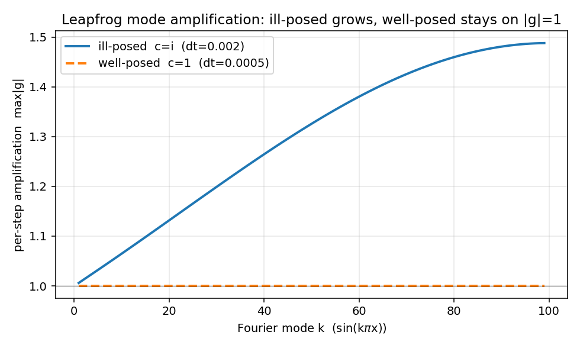

# wavelab 教程 · 2 — 显式有限差分：最直接的解法，以及它为什么必然爆炸

本章从 Taylor 展开出发构造差分格式（`wavelab/solvers/fd_explicit.py`），然后用
**von Neumann 分析**精确预言它在 $c=i$ 问题上的爆炸行为——包括"网格越细死得越早"
这个反直觉的实验事实。

## 2.1 从 Taylor 展开到差分公式

有限差分的全部思想：**用网格点上的函数值的线性组合近似导数**。对光滑的 $u$，
在 $x$ 处向两边展开：

$$u(x\pm h) = u \pm h\,u_x + \frac{h^2}{2}u_{xx} \pm \frac{h^3}{6}u_{xxx} + \frac{h^4}{24}u_{xxxx}(\xi_\pm).$$

两式**相加**（奇数阶导数全部抵消）：

$$u(x+h) + u(x-h) = 2u + h^2 u_{xx} + O(h^4)$$

$$\Longrightarrow\quad
\boxed{\;u_{xx} \approx \frac{u(x+h) - 2u(x) + u(x-h)}{h^2}\;}\qquad \text{误差 } O(h^2).$$

这就是**二阶中心差分**。时间方向同理，得到对 $u_{tt}$ 的同款近似。

## 2.2 Leapfrog（蛙跳）格式

把空间切成 $N$ 个点 $x_j$（步长 $\Delta x$），时间切成步长 $\Delta t$，记
$u_j^n \approx u(x_j, n\Delta t)$。把方程 $u_{tt} = c^2 u_{xx} + f(u)$ 的两边都用
中心差分替换：

$$\frac{u_j^{n+1} - 2u_j^n + u_j^{n-1}}{\Delta t^2}
 = c^2\,\frac{u_{j+1}^n - 2u_j^n + u_{j-1}^n}{\Delta x^2} + f(u_j^n)$$

解出唯一的未知量 $u_j^{n+1}$（这就是"**显式**"的含义——新时刻的值由旧值直接算出，
不用解方程组）：

$$\boxed{\;u_j^{n+1} = 2u_j^n - u_j^{n-1} + \Delta t^2\Big[\,c^2\,\frac{u_{j+1}^n - 2u_j^n + u_{j-1}^n}{\Delta x^2} + f(u_j^n)\Big]\;}\tag{2.1}$$

两个补丁让它成为完整算法：

**① 起步问题**：格式需要两层历史 $u^{n-1}, u^n$，但初值只给了一层。用 Taylor 展开
造出第一层：

$$u^1_j = u^0_j + \Delta t\,\psi(x_j) + \frac{\Delta t^2}{2}\Big[c^2 (u^0)_{xx} + f(u^0)\Big]_j
$$

（就是 $u(\Delta t)\approx u(0) + \Delta t\,u_t(0) + \frac{\Delta t^2}{2}u_{tt}(0)$，
其中 $u_{tt}(0)$ 用方程本身代掉。）对应代码：

```python
u = u_prev + dt * v0 + 0.5 * dt**2 * rhs(u_prev)
```

**② 边界**：Dirichlet 条件 $u(0)=u(1)=0$，每步结束把两端钉回零。

## 2.3 von Neumann 稳定性分析：预言爆炸

现在回答关键问题：**误差在这个格式下如何演化**。

### 网格上的特征模

离散 Laplace 算子在 Dirichlet 网格上的特征向量恰好还是正弦模
$v_j = \sin(k\pi x_j)$。代入中心差分（用积化和差）：

$$\frac{v_{j+1} - 2v_j + v_{j-1}}{\Delta x^2} = -\mu_k\, v_j,
\qquad \mu_k = \frac{2 - 2\cos(k\pi \Delta x)}{\Delta x^2}. \tag{2.2}$$

对照连续情形的 $k^2\pi^2$：低频时 $\mu_k \approx k^2\pi^2$（Taylor 展开
$\cos\theta\approx 1-\theta^2/2$），最高频 $k=N-2$ 时 $\mu_{\max} \approx 4/\Delta x^2$。
**网格越细（$\Delta x$ 越小），能表示的最高频率越高，$\mu_{\max}$ 越大**——记住这句。

### 单模演化与放大因子

线性化（$f'(0)=a_1$），设解的某一模式按 $u_j^n = g^n \sin(k\pi x_j)$ 演化
（$g$ = 每步放大因子）。代入格式 (2.1)，令 $\omega_k = c^2(-\mu_k) + f'(0)$、
$a = \Delta t^2\omega_k$，两边除以 $g^{n-1}\sin(k\pi x_j)$：

$$g^2 - (2 + a)\,g + 1 = 0. \tag{2.3}$$

注意**常数项是 1**：两根满足 $g_+ g_- = 1$。这个小事实在第 3 章会变成主角。求根：

$$g_\pm = \frac{(2+a) \pm \sqrt{(2+a)^2 - 4}}{2}.$$

- **判别式 $< 0$**（即 $-4 < a < 0$）：两根共轭，$|g_\pm| = \sqrt{g_+g_-} = 1$
  —— 模式在单位圆上转，**稳定**。
- **判别式 $> 0$**：两根实且乘积为 1，必有一根 $|g| > 1$ —— **指数增长**。

### 两种波速的判决

**$c=1$（适定）**：$\omega_k = -\mu_k - 1 < 0$，所以 $a < 0$。只要
$|a| = \Delta t^2(\mu_k + 1) < 4$ 对所有 $k$ 成立——即著名的 **CFL 条件**
$\Delta t \lesssim \Delta x$（用 $\mu_{\max}\approx 4/\Delta x^2$ 代入）——所有模式
都稳定。**网格加密只要同时缩 $\Delta t$，格式就收敛**：这是教科书的美好世界。

**$c=i$（不适定）**：$\omega_k = +\mu_k - 1 > 0$，$a > 0$，判别式
$(2+a)^2 - 4 > 0$ **恒成立**。**每一个模式都有增长根**，且 $\mu_k$ 越大增长越快：

$$g_{\max} \approx 1 + \sqrt{a} = 1 + \Delta t\sqrt{\mu_k - 1}.$$

这不是格式的缺陷——回看 1.3 节，**真实动力学就是让 $k$ 号模按 $e^{\sqrt{\mu_k}t}$
增长**，格式只是忠实地复现了它（一致性使然）。灾难在于：舍入误差（$\sim 10^{-16}$）
含有全部频率，其中网格最高频模式以每步 $g_{\max}$ 的速率复利增长。



上图（`experiments.mode_amplification` 生成）：$c=i$ 时放大因子随 $k$ 单调上升，
$N=101,\Delta t = 0.002$ 时最高模 $g \approx 1.488$；$c=1$ 时整条线钉在 1。

### 定量预言爆炸时刻

最高频模从舍入误差 $10^{-16}$ 长到 $O(1)$ 所需步数：

$$1.488^n \cdot 10^{-16} \sim 1 \quad\Longrightarrow\quad n \approx \frac{16\ln 10}{\ln 1.488} \approx 93 \text{ 步} \approx t = 0.19.$$

实测 $N=101$ 爆炸于 $t=0.232$（量级完全吻合；稍晚是因为舍入噪声在最高模上的初始
投影小于 $10^{-16}$）。**网格加密 → $\mu_{\max}$ 变大 → $g_{\max}$ 变大 → 爆得更早**：

| $N$ | $\Delta x$ | 实测爆炸时刻（$\Delta t=0.002$） |
|---|---|---|
| 51 | 0.02 | 0.440 |
| 101 | 0.01 | 0.232 |
| 201 | 0.005 | 0.128 |

（`tests/test_illposed_signature.py` 把这三个数字锁成回归测试。）适定问题里
"加密网格改善结果"，这里**加密网格加速死亡**——这就是不适定性的数值指纹。

## 2.4 代码走读：`fd_explicit.py`

核心不过 30 行，逐块对应上面的数学：

```python
def rhs(u):                       # 方程右端 c²·u_xx + f(u)
    d2 = np.zeros_like(u)
    d2[1:-1] = (u[2:] - 2*u[1:-1] + u[:-2]) / dx**2    # 中心差分 (2.1 中括号)
    r = c2 * d2 + f(u)             # f 来自 eq.f_callable()——由系数 dict 拼出
    r[0] = r[-1] = 0.0             # 边界行不参与演化
    return r

def clamp(u):                      # Dirichlet：每步把两端钉回 0
    u[0] = u[-1] = 0.0
```

`clamp` 看似多余（"边界本来就是 0"），实则必要：若某方程的 $\varphi$ 在边界不为
0，$2u^n - u^{n-1}$ 会把非零值漏进来。`sin(\pi x)$ 恰好边界为零，会掩盖这个 bug——
所以测试里专门有一个 $\varphi \equiv 1$ 的用例。

主循环（`_march`，1D/2D 共用）：

```python
for n in range(2, steps + 1):
    u_next = 2*u - u_prev + dt**2 * rhs(u)   # 蛙跳公式 (2.1)
    clamp(u_next)
    u_prev, u = u, u_next
    if not np.all(np.isfinite(u)):           # 检测到 inf/NaN：
        blowup_time = round(n * dt, 10)      #   记下时刻，
        warnings.warn(...)                   #   发个警告，
        break                                #   停止——但不抛异常！
```

**设计决定：爆炸是数据，不是错误**。在这个项目里，"什么时候爆"本身就是要测量的
科学量（上面的表格就是这么来的），所以求解器把它记进 `meta["blowup_time"]`，爆炸
之后的时刻填 NaN，照常返回 `Solution`。下游的 `blowup_scan` 直接消费这个字段。

2D 版本（`_solve_2d`）只是把中心差分换成五点格式
$\frac{u_{i+1,j}+u_{i-1,j}+u_{i,j+1}+u_{i,j-1}-4u_{ij}}{h^2}$、把 `clamp` 换成清空
四条边，主循环一字不改——这是把 `_march` 抽出来共用的原因。

## 2.5 动手复现

```python
from wavelab import library, ExplicitFD
from wavelab.experiments import blowup_scan, blowup_table, mode_amplification

eq = library.SINE_CI_1D
rows = blowup_scan(eq, lambda N, dt: ExplicitFD(N=N, dt=dt),
                   Ns=(51, 101, 201), dts=(0.002,), probe_time=0.5)
print(blowup_table(rows))          # ← 复现 2.3 节的表格

m = mode_amplification(eq, N=101, dt=0.002)
print(m["growth"][0], m["growth"][-1])   # 1.006, 1.488 ← 复现放大因子
```

## 2.6 本章小结

1. 差分格式 = Taylor 展开的代数重排；蛙跳格式显式、二阶精度。
2. 稳定性由每个网格模的放大因子 $g$ 决定（方程 (2.3)），$g_+g_-=1$。
3. $c=1$：CFL 条件下全稳定。$c=i$：**所有模式必有增长根**——因为真解就在增长，
   一致的格式必须复现它；被炸上天的是舍入噪声的高频成分。
4. 爆炸时刻可以由 $g_{\max}$ 定量预言；网格越细爆得越早（不适定指纹）。
5. 代码层面：爆炸是一等公民数据（`meta["blowup_time"]`），不是异常。

自然的下一个念头："显式不稳定，那换**隐式**格式呢？"——这是第 3 章，答案会出乎
意料。

[→ 下一章：隐式格式与正则化](03-implicit-and-regularization.md)
