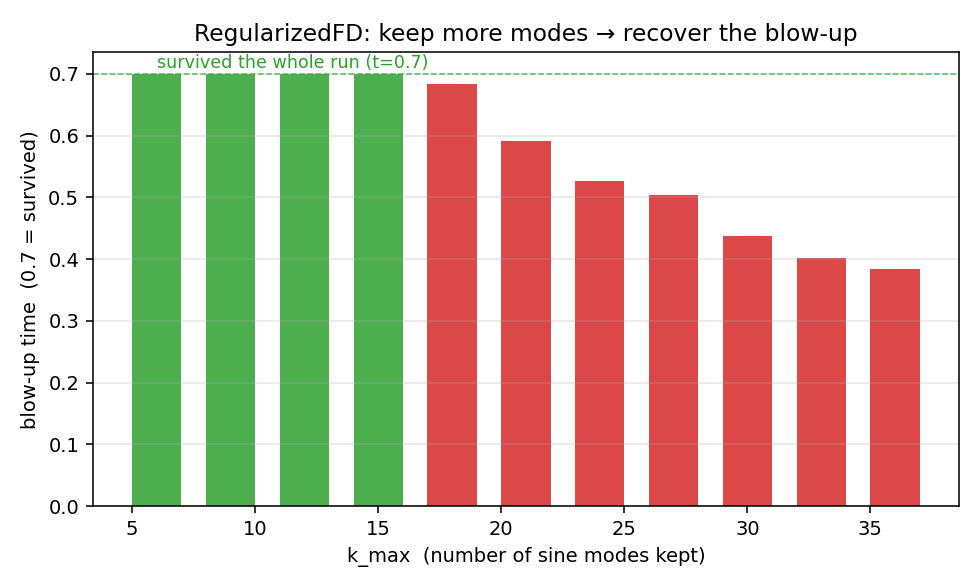

# wavelab 教程 · 3 — 隐式格式救不了不适定，正则化才能

第 2 章结尾的自然念头："显式爆炸？换隐式！"本章实现三个隐式/改良格式并证明：
**前两个照样死**（一个死得无声无息，比显式更危险），只有第三个——主动删除高频模
的**正则化格式**——能活，而且它的代价恰好印证了论文对 Figure 7 的那句评语。

涉及代码：`fd_implicit.py`（θ-格式）、`fd_implicit_linear.py`（论文的方法）、
`fd_regularized.py`（有效的方法）。

## 3.1 隐式格式的希望从何而来

在**刚性 ODE** 的世界里，隐式方法确实是稳定性神器：对 $y' = -1000y$（快速衰减），
显式 Euler 要 $\Delta t < 0.002$ 否则振荡爆炸，而隐式（backward）Euler
$y^{n+1} = y^n + \Delta t\,(-1000\,y^{n+1})$ 解出

$$y^{n+1} = \frac{y^n}{1 + 1000\Delta t}$$

——任意大步长都稳定。**直觉：隐式把"放大"变成"除法"，天然带阻尼。**

这个直觉搬到我们的问题上会失败,而失败的方式非常有教育意义。先把格式建起来。

## 3.2 θ-格式：推导与实现

把蛙跳格式右端的空间算子在三个时间层上加权平均（$R(u) = c^2 L u + f(u)$，
$L$ = 二阶差分矩阵）：

$$\frac{w - 2u^n + u^{n-1}}{\Delta t^2}
 = \theta R(w) + (1-2\theta)R(u^n) + \theta R(u^{n-1}),
 \qquad w := u^{n+1}. \tag{3.1}$$

- $\theta = 0$：退回显式蛙跳（代码有测试：两者逐位一致到 $10^{-9}$）。
- $\theta = \tfrac12$：经典的"无条件稳定"配置（对适定问题而言）。

未知量 $w$ 出现在非线性的 $R(w)$ 里，得解非线性方程组 $G(w)=0$：

$$G(w) = w - 2u^n + u^{n-1} - \Delta t^2\big[\theta R(w) + (1-2\theta)R(u^n) + \theta R(u^{n-1})\big].$$

用 **Newton 迭代**：从初猜 $w_0 = u^n$ 出发，反复解线性系统

$$G'(w_m)\,\delta = -G(w_m),\qquad w_{m+1} = w_m + \delta,$$

其中 Jacobian $G'(w) = I - \Delta t^2\theta\,(c^2 L + \mathrm{diag}(f'(w)))$——
这就是 `WaveEquation.f_prime_callable()`（$f' = \sum k\,a_k u^{k-1}$）存在的原因。
Newton 二次收敛，实测每步 ≤ 6 次迭代（有测试）。边界处理：把 $G$ 和 $G'$ 的首末
行替换成恒等式 $w_0 = w_{N-1} = 0$。$N \le 201$，直接用稠密 `np.linalg.solve`，
不引入 scipy。

## 3.3 判决：能量守恒的诅咒

对 (3.1) 做与 2.3 节相同的单模分析（线性化，$a = \Delta t^2\omega_k$）：

$$\underbrace{(1 - \theta a)}_{A}\,g^2 - \underbrace{(2 + (1-2\theta)a)}_{B}\,g + \underbrace{(1 - \theta a)}_{A} = 0.$$

**首项系数与常数项相同**。于是不管 $\theta$ 取多少：

$$g_+ \, g_- = \frac{A}{A} = 1. \tag{3.2}$$

两根之积恒为 1 ——这就是"θ-格式**能量守恒**"的代数形式：它不会耗散任何东西。
后果立现：

- 两根共轭 ⟹ $|g_\pm|=1$，中性稳定；
- 两根实 ⟹ 一根在单位圆内，**另一根必在圆外**。

而 $c=i$ 时 $\omega_k > 0$ 使判别式恒正、两根恒实——**每个模式都有增长根，任何 θ
都无济于事**。隐式在这里买不到稳定，因为稳定需要**阻尼**，而守恒格式恰好被禁止
拥有阻尼。

实测（$N=101, \Delta t=0.002, \theta=0.5$，MC 真值来自第 4 章）：

| $t$ | MC 真值 $u(0.5,t)$ | θ-格式 |
|---|---|---|
| 0.1 | 0.948 | **0.9479** ✓（格式本身实现正确！） |
| 0.2 | 0.990 | 26.6 |
| 0.3 | 1.135 | 1557.2 |
| 0.4 | 1.412 | 1988.2 |

注意最阴险的一点：**它全程输出有限数**。没有 NaN、没有警告、`blowup_time=None`
——显式格式至少死得诚实（NaN 报丧），θ-格式产出的是**看起来像答案的垃圾**。
`tests/test_fd_implicit.py` 专门把这个行为锁成测试（断言 $t=0.3$ 时误差 $>100$），
注释写明：**不许"修复"它，它是反例本体**。

## 3.4 论文实际用的方法：Linearly Implicit Euler

论文 §7.2 对 Figure 7 的原话：用 Mathematica `NDSolveValue` 的
**`LinearlyImplicitEuler`** 选项，并评价

> "the implicit scheme is more stable but exhibits a loss of accuracy compared to
> the explicit scheme **due to loss of energy conservation**."

这句话有两层信息：① 他们的隐式方法**不守恒**（所以 3.3 的诅咒不适用）；② 稳定性
正是**用能量损耗买来的**。`fd_implicit_linear.py` 忠实实现这个方法：化成一阶系统
$u_t = v,\ v_t = R(u)$，对**线性部分隐式**、非线性项显式：

$$(I - \Delta t^2 c^2 L)\,u^{n+1} = u^n + \Delta t\,v^n + \Delta t^2 f(u^n),
\qquad v^{n+1} = \frac{u^{n+1}-u^n}{\Delta t}.$$

系数矩阵恒定，求逆一次反复用，无需 Newton（非线性显式处理还避开了 Newton 在
$u^3$ 上跳到伪根的风险）。它的单模放大因子是

$$g_\pm = \frac{1}{1 \mp \Delta t\sqrt{\omega_k}}.$$

对增长模（$\omega_k>0$）：$g_+$ 在 $\Delta t\sqrt{\omega_k} \to 1$ 时有一个**极点**。
$\omega_k$ 横跨 $8.9 \sim 4\times10^4$（$N=101$），无论 $\Delta t$ 取多少，总有某个
模式撞在极点附近被暴力放大。实测每个 $\Delta t$ 都爆炸（0.002→爆于 t=0.18，
0.005→0.05，0.01→0.15，0.02→0.28）。Mathematica 的同名方法靠自适应步长与内置
耗散侥幸画出曲线；**定步长的忠实实现没有这种运气**。

## 3.5 更深的结论：没有一致的推进格式能活

把 3.3、3.4 与第 2 章合起来，模式浮现：

> 真解的 $k$ 号模按 $e^{k\pi t}$ 增长（1.3 节），这是**方程的性质，不是格式的性质**。
> 任何**一致**（consistent，即 $\Delta t,\Delta x\to 0$ 时逼近原方程）的时间推进
> 格式都必须复现这个增长——否则它解的就不是这个方程。因此它也必须把舍入噪声的
> 高频成分放大到 $O(1)$。**必然爆炸。**
>
> 一个格式想"看起来稳定"，唯一的办法是**拒绝复现某些增长**——即引入耗散、去解
> 一个被修改过的问题。稳定是买来的，货币是精度。

这就把"用哪个格式"的问题变成了"**修改哪个问题**"的问题——下一节给出最透明的
修改方式。

## 3.6 正则化：谱截断（真正有效的方法）

既然祸根是高频模（$k$ 大 → 增长快 → 噪声致命），最直接的正则化就是**根本不让
高频存在**：每步演化后，把解投影到前 $k_{\max}$ 个正弦模上（quasi-reversibility
/ 谱截断，是不适定问题的经典正则化手段）。

### 投影矩阵的构造

内点 $j = 1,\dots,N-2$ 上的离散正弦基 $S_{jk} = \sin\!\big(\frac{\pi k j}{N-1}\big)$
（DST-I）满足正交性

$$\sum_{j=1}^{N-2} S_{jk} S_{jm} = \frac{N-1}{2}\,\delta_{km},$$

所以"保留前 $K$ 个模"的正交投影为

$$P = \frac{2}{N-1}\, S_K S_K^{\top}, \qquad S_K = S \text{ 的前 } K \text{ 列}.$$

代码 `sine_lowpass(N, k_max)` 就是这三行；测试验证 $P^2 = P$（幂等）、$P=P^\top$、
低模保真（$P\sin(3\pi x)=\sin(3\pi x)$）、高模歼灭（$P\sin(25\pi x)=0$）。

### 算法 = 蛙跳 + 每步过滤

```python
u_next = 2*u - u_prev + dt**2 * rhs(u)
filt(u_next)          # u[1:-1] = P @ u[1:-1]  ← 全部新意在这一行
```

被删掉的模式**永远无法被舍入噪声激发**——增长的种子直接不存在。

### 实测：论文 Fig-7 叙事的完整复现

$N=101, \Delta t = 0.002, k_{\max}=12$，对照 MC 真值：

| $t$ | 0.1 | 0.2 | 0.3 | 0.4 | 0.7 |
|---|---|---|---|---|---|
| MC 真值 | 0.948 | 0.992 | 1.140 | 1.418 | 4.559 |
| RegularizedFD | 0.948 | 0.991 | 1.137 | 1.418 | **4.705** |

- $t\le 0.4$：三位有效数字吻合（显式在 $N=101$ 时 $t=0.232$ 就死了，它没事）；
- $t = 0.7$：**平滑、稳定，但偏了 0.15**（≈ 30 倍 MC 标准误——是真实的偏差，不是
  噪声）。这正是论文那句 "more stable but a loss of accuracy"。

而正则化的"代价旋钮"清晰可见——**多留模式 = 找回你刚压制的不适定性**：



$k_{\max}=12$ 活到 0.7；$k_{\max}=20$ 死于 0.64；$k_{\max}=30$ 死于 0.438。与
"网格越细死得越早"是同一个指纹，只是这次变量直接就是**你允许存在的最高频率**。

为什么 $k_{\max}=12$ 在 $t\le0.4$ 几乎无损？因为真解此时的频谱几乎全在 $k \le 7$
（初值只有 $k=1$，$u^3$ 逐级喂出 $k=3,5,7,\dots$，系数迅速衰减）；被删的模式本来
就近似为零。$t$ 再大，真解需要的模式数超过稳定性允许的数目——精度损失就成为
**结构性的**，加密网格、缩小步长都救不回来。

## 3.7 你可能听说过的"隐式差分能解"——当心两个参考实现的坑

调研中发现两个现成"参考代码"都不可作为验证基准（细节见
`docs/agents/gotchas.md`）：

1. C++ `Simulation_07`（d=2）：分支系数 `a₃` 写成了 $-1$，与它自己 README 的
   $f=-u+u^3$（$a_3=+1$）矛盾；
2. `wave_equation/finite_differences_wave_1D.ipynb`："隐式"记号下实际
   `theta=0.0005`（注释却说 0.5），且空间算子符号解的是**适定**问题——它显得稳定
   是因为它根本没在解椭圆问题。

这也是为什么 wavelab 的验证策略是**闭式解 + 交叉验证**，从不对拍第三方输出。

## 3.8 本章小结

1. θ-格式：隐式 + Newton，实现正确（$\theta=0$ 复现显式、小 $t$ 对准真值）——
   但 $g_+g_-=1$（能量守恒）注定它在不适定问题上**无声地产出垃圾**。
2. 论文的 LinearlyImplicitEuler：定步长实现有放大因子极点，照样爆。
3. **定理级结论**：一致格式必然爆炸；稳定只能用耗散（= 修改问题）购买。
4. 谱截断正则化是最透明的购买方式：$k_{\max}$ 就是价签。小 $t$ 免费，大 $t$ 付
   精度。
5. 全部现象都能从一个方程 $g^2 - (2+a)g + 1 = 0$ 及其变体读出来。

下一章换一条完全不同的路：不再推进任何网格，把解**一个点一个点地**写成期望。

[→ 下一章：分支蒙特卡洛](04-branching-monte-carlo.md)
