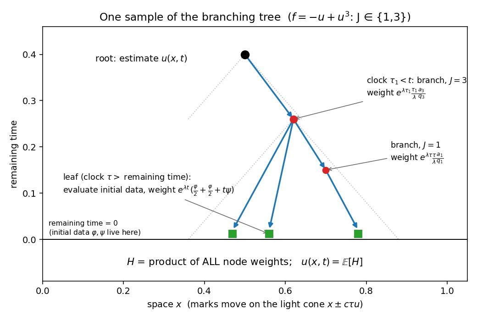
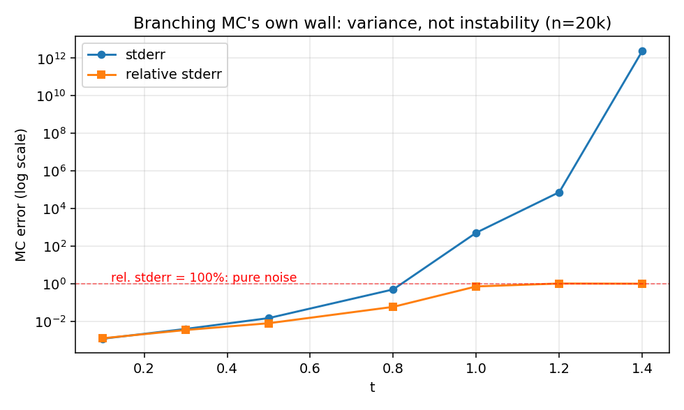

# wavelab 教程 · 4 — 分支蒙特卡洛：把解写成一棵随机树的期望

本章从第 1 章的积分表示 (1.1) 出发，一步一步推导出分支蒙特卡洛估计量，做到
**每一个数学步骤对应 `mc/reference.py` 的一行代码**。读完你可以独立重写这个求解器。

核心结论先行：解可以写成

$$u(z,t) = \mathbb{E}\big[H(z,t)\big],$$

其中 $H$ 是一棵**随机分支树**的函数值——树由三个随机机制生成（指数钟、光锥标记、
分支），$H$ 是沿途所有权重的**乘积**。估计 $u$ 就是采样这棵树 $n$ 次取平均。



## 4.1 出发点：温和形式是一个"自指"的积分方程

第 1 章的式 (1.1)（含源项的 d'Alembert 公式）：

$$u(z,t) = \underbrace{\frac{\varphi(z+ct)+\varphi(z-ct)}{2}}_{I_1}
 + \underbrace{\frac{1}{2c}\int_{z-ct}^{z+ct}\psi(y)\,dy}_{I_2}
 + \underbrace{\frac{1}{2c}\int_0^t\!\!\int_{z-c(t-s)}^{z+c(t-s)} f\big(u(y,s)\big)\,dy\,ds}_{I_3}$$

右边的 $I_3$ 里还有未知的 $u$——这不是缺陷而是机会：**递归结构天然适合递归采样**。
我们的策略是把每个积分都改写成某个随机变量的期望，$I_3$ 里的 $u$ 则递归地用同一
套办法表示。以下三步分别处理 $I_2$、时间积分、非线性。

## 4.2 第一步：把 $\psi$ 的积分变成均匀随机点

设 $U \sim \mathrm{Uniform}(-1,1)$。区间 $[z-ct,\, z+ct]$ 上的点可写成 $z + ctU$，
且 $\mathbb{E}[\psi(z+ctU)] = \frac{1}{2ct}\int_{z-ct}^{z+ct}\psi(y)\,dy$
（均匀密度 = $\frac{1}{\text{区间长}}$）。反解出积分：

$$I_2 = \frac{1}{2c}\int_{z-ct}^{z+ct}\psi\,dy = t\;\mathbb{E}\big[\psi(z + ctU)\big].$$

代码里 $U = 2p-1$（$p\sim\mathrm{U}(0,1)$）：

```python
t * psi(z + C * t * (2 * p - 1))        # = I₂ 的单样本无偏估计
```

$c$ 是复数也没关系——$z+ctU$ 只是复平面上的一个点，$\psi$ 是解析函数照常求值。
这就是为什么 `WaveEquation` 强制 $\varphi,\psi$ 必须接受复数参数。

## 4.3 第二步：把时间积分变成指数钟

**引理（指数钟换积分）**：设 $\tau\sim\mathrm{Exp}(\lambda)$（密度
$\lambda e^{-\lambda s}$），$g$ 为任意（可积）函数，则

$$\mathbb{E}\Big[\mathbf{1}_{\{\tau\le t\}}\;\frac{e^{\lambda\tau}}{\lambda}\;g(\tau)\Big]
 = \int_0^t \lambda e^{-\lambda s}\cdot\frac{e^{\lambda s}}{\lambda} g(s)\,ds
 = \int_0^t g(s)\,ds. \qquad\blacksquare$$

权重 $e^{\lambda\tau}/\lambda$ 恰好抵消密度——这是**重要性采样**：$\lambda$ 怎么选
都不改变期望（只改变方差）。同一个 $\tau$ 顺便处理常数项：
$\mathbb{P}(\tau > t) = e^{-\lambda t}$，所以对任何常数 $C$，

$$C = \mathbb{E}\big[\mathbf{1}_{\{\tau> t\}}\,e^{\lambda t}\,C\big].$$

于是**一次抽取 $\tau$，两种命运**：

- $\tau > t$（钟没响）→ 负责 $I_1 + I_2$，补偿权重 $e^{\lambda t}$；
- $\tau \le t$（钟响了）→ 负责 $I_3$ 在 $s=\tau$ 处的贡献，权重 $e^{\lambda\tau}/\lambda$。

## 4.4 第三步：源项的空间积分（换元 + 均匀标记）

对 $I_3$ 先做换元 $s \mapsto t-s$（把"绝对时刻"换成"剩余时间"，让光锥宽度直接
用钟的读数表达）：

$$I_3 = \frac{1}{2c}\int_0^t\!\!\int_{z-cs}^{z+cs} f\big(u(y,\,t-s)\big)\,dy\,ds
 = \int_0^t s\;\mathbb{E}_U\Big[f\big(u(z+csU,\;t-s)\big)\Big]\,ds$$

（内层空间积分用 4.2 的手法：宽度 $2cs$，除以 $2c$ 剩 $s$。）再用 4.3 的引理吃掉
外层时间积分（$g(s) = s\,\mathbb{E}_U[\cdot]$）：

$$I_3 = \mathbb{E}\Big[\mathbf{1}_{\{\tau\le t\}}\;
   e^{\lambda\tau}\,\frac{\tau}{\lambda}\;
   f\big(u(\underbrace{z+c\tau U}_{\text{新位置}},\;\underbrace{t-\tau}_{\text{剩余时间}})\big)\Big].$$

对照代码（`_sample` 的分支路径）：

```python
znew = z + c * tau * (2 * p - 1)          # 光锥标记：新位置
...  # (weight) math.exp(lam*tau) * (tau/lam) * ...   # e^{λτ}·τ/λ
```

## 4.5 第四步：非线性 → 分支（乘积的期望 = 期望的乘积）

还剩 $f(u) = \sum_k a_k u^k$ 里的 $u^k$。关键恒等式：若
$H^{(1)},\dots,H^{(k)}$ 是 $H(z',t')$ 的**独立**副本，则

$$u(z',t')^k = \big(\mathbb{E}[H]\big)^k = \mathbb{E}\Big[\prod_{i=1}^k H^{(i)}\Big]$$

——**独立**是唯一的要求（期望的乘积 = 乘积的期望）。这就是"分支成 $k$ 个孩子"的
数学身份：每个孩子是一次独立的递归采样。

对求和 $\sum_k a_k u^k$，再做一次重要性采样：按分布 $q$（$\sum q_k = 1$）随机选幂次
$J$，权重 $a_J/q_J$：

$$\mathbb{E}\Big[\frac{a_J}{q_J}\,u^J\Big] = \sum_k q_k\,\frac{a_k}{q_k}\,u^k = f(u).$$

$q$ 与 $\lambda$ 一样是**自由参数**——只改方差不改均值（有专门的测试：换
$q=\{0.7, 0.3\}$，均值在统计误差内不动）。对 $f=-u+u^3$ 默认 $q_1=q_3=\frac12$，
权重分别为 $a_1/q_1 = -2$、$a_3/q_3 = 2$。$k=0$（常数项）意味着"零个孩子"，
空乘积 $=1$，同样成立。

## 4.6 组装：估计量的递归定义与无偏性

把四步合起来，定义随机泛函 $H(z,t)$：

$$H(z,t) = \begin{cases}
 e^{\lambda t}\Big[\dfrac{\varphi(z+ct)+\varphi(z-ct)}{2} + t\,\psi(z+ctU)\Big]
   & \tau > t \quad(\text{叶子})\\[2ex]
 e^{\lambda\tau}\,\dfrac{\tau}{\lambda}\,\dfrac{a_J}{q_J}\,
   \displaystyle\prod_{i=1}^{J} H^{(i)}\big(z + c\tau U,\; t-\tau\big)
   & \tau \le t \quad(\text{分支})
\end{cases}$$

**命题（无偏性）**：$v(z,t) := \mathbb{E}[H(z,t)]$ 满足与 $u$ 相同的积分方程 (1.1)。

*证明思路*：对 $\tau$ 的两种命运取全期望：叶子路径给出 $I_1 + I_2$（4.2、4.3）；
分支路径由 4.4、4.5 给出 $\mathbb{E}[\cdots f(v(\text{mark}, t-\tau))]$ ——注意
孩子们是独立副本，其期望是 $v$，于是恰好还原 $I_3$（其中 $u$ 换成 $v$）。所以
$v$ 是 (1.1) 的解；在短时间窗口内 (1.1) 的解唯一（压缩映射论证），故
$v = u$。$\blacksquare$

严格性备注：这要求 $\mathbb{E}|H| < \infty$（可积性），论文对此给出充分条件——
这正是"方法只在**短时间**有效"的数学根源，也是 4.10 节方差之墙的伏笔。树本身
几乎必然有限：每次分支后剩余时间严格减少，钟响次数在有限时间内几乎必然有限。

## 4.7 为什么它对不适定性完全免疫

回看第 2、3 章的死因链条：**网格上的耦合状态 → 含全频噪声 → 高频被逐步放大**。
分支 MC 把每一环都拆掉了：

| 差分法 | 分支 MC |
|---|---|
| 维护整张网格的耦合状态 | **每个点独立**计算，点与点互不通信 |
| 按时间步推进，误差逐步累积放大 | **没有时间推进**——每个样本一次性算完 |
| 舍入噪声被当作初值的一部分演化 | 噪声不进入任何演化回路；样本间独立平均 |
| 只能在实数网格上算 | 可在**任意复数点** $z$ 求值（论文算例大量用到） |

不存在"网格模式"这个概念，1.4 节的放大机制就无从谈起。MC 的误差是纯统计的：
$\text{stderr} = \sigma/\sqrt{n}$，由中心极限定理控制，与网格、步长、频率都无关。

## 4.8 代码走读：`mc/reference.py` 与公式逐行对照

```python
def _sample(z, t, c, lam, phi, psi, powers, coeffs, probs, rng):
    tau = rng.exponential(1.0 / lam)      # τ ~ Exp(λ)。注意 numpy 的参数是均值 1/λ！
    p = rng.random()                      # 光锥标记用的均匀变量 U = 2p−1
    if tau > t:                           # ---- 叶子（钟没响）----
        return math.exp(lam * t) * (      #   权重 e^{λt} ×
            phi(z + c * t) / 2            #   I₁ 的一半
            + phi(z - c * t) / 2          #   I₁ 的另一半
            + t * psi(z + c * t * (2*p-1))#   I₂ = t·ψ(光锥内均匀点)
        )
    j = rng.choice(len(powers), p=probs)  # ---- 分支：按 q 选幂次 J ----
    k, a, q = int(powers[j]), coeffs[j], probs[j]
    znew = z + c * tau * (2 * p - 1)      # 光锥标记：新位置（复数！）
    H = 1 + 0j
    for _ in range(k):                    # J 个独立孩子（k=0 → 空乘积 = 1）
        H *= _sample(znew, t - tau, ...)  # 剩余时间 t−τ，递归
    return math.exp(lam*tau) * (tau/lam) * (a/q) * H   # e^{λτ}·(τ/λ)·(a_J/q_J)·∏
```

与 4.6 的定义**逐符号一致**。`estimate` 则是朴素的样本均值 + 标准误：

```python
mean = samples.mean()
stderr = samples.std() / sqrt(n)          # 复样本的 std = sqrt(E|x−mean|²)
```

**易错点**（都被测试锁定）：
- `rng.exponential(1.0/lam)`——numpy 的参数是 scale（均值），不是 rate。写成
  `exponential(lam)` 均值就错成 $\lambda$，整个估计悄悄偏掉。
- 全程 `complex128`；结果的虚部应 $\approx 0$（统计噪声级别），测试断言
  $|\mathrm{Im}\,u| < 0.02$，但**不许手动清零**——虚部大小本身是正确性信号。
- 验证靠闭式解：`SIM01`（$f=u^2$，$u = 6/(z+\sqrt2 t)^2$）等 8 个 golden test，
  误差要求 $< 3\times$ 标准误。

## 4.9 numba 快速后端：`mc/fast.py`

纯 Python 递归大约 20k 样本/秒；论文规模（$10^6\sim10^7$ 样本）需要提速。
`fast.py` 的两个关键技巧：

1. **递归 → 显式栈**。注意 $H$ 是**所有节点权重的乘积**——不需要真的建树、
   自底向上归并；维护一个"待处理节点栈"（元素 $(z, t_{\text{剩余}})$）和一个
   **运行乘积** `H`，弹出节点 → 抽钟 → 叶子就乘上叶权重 / 分支就乘上分支权重并
   压入 $J$ 个孩子。栈空时 `H` 即为一个完整样本。
2. **可复现的并行**。`prange` 并行的是**网格点**，每个点用 `seed + i` 独立播种——
   结果与线程数无关（有测试：两次运行逐位相等）。

限制：numba 后端要求 $\varphi,\psi$ 是 `numba.njit` 编译过的函数（普通 lambda 会
得到明确的报错信息），且目前只支持 $d=1$。实测 $10^6$ 样本约 4 秒（含 JIT）。
两个后端用同一组种子跑出的均值在联合标准误内一致（`test_backends_agree.py`）。

## 4.10 高维（d = 2, 3）：光锥采样与梯度项

$d\ge2$ 的波动方程解公式不再是 d'Alembert，而是 Poisson 型球面/圆盘平均，
概率化之后叶子多出一个**梯度项**（$d=1$ 完全没有的结构）：

$$\text{叶子} = e^{\lambda t}\Big[\varphi(z+y) + y\cdot\nabla\varphi(z+y) + t\,\psi(z+y)\Big],$$

标记 $y$ 的采样（按论文核函数，移植自 C++ Simulation 07/08 并用闭式解验证）：

| 维度 | 标记 $y$ | 几何 |
|---|---|---|
| $d=2$ | $R = s\sqrt{1-(1-p)^2}$，$y = cR(\cos\theta, \sin\theta)$ | 圆盘（有偏径向密度） |
| $d=3$ | $\alpha = \arccos(1-2p)$，$y = cs(\sin\alpha\cos\theta, \sin\alpha\sin\theta, \cos\alpha)$ | 球面（均匀） |

这就是 `WaveEquation` 有 `grad_phi` 字段的原因：$d\ge2$ 时 MC 必须知道
$\nabla\varphi$（构造时校验元数，缺失则报错指明）。分支与权重结构与 $d=1$ 完全
相同。验证：SIM05（d=2）、SIM08（d=3）闭式解 + tanh 孤子，全部 $3\sigma$ 内。

> ⚠️ 不要对拍 C++ `Simulation_07` 的输出——它的 $a_3$ 符号与自家 README 矛盾
> （详见 `docs/agents/gotchas.md`）。wavelab 从 `eq.f` 推导系数，构造上免疫此错。

## 4.11 天下没有免费的午餐：方差之墙

MC 不会爆炸，但它有自己的死法。$t$ 增大时：钟在 $[0,t]$ 内响的概率上升 → 树更深
更宽（三胞胎分支！）→ 权重 $e^{\lambda\tau}\frac{\tau}{\lambda}\frac{a_J}{q_J}$
连乘起来方差急剧膨胀。超出可积性窗口后 $\mathrm{Var}[H]=\infty$：均值仍无偏，但
标准误不再随 $\sqrt{n}$ 收敛——估计量退化为噪声。



实测（SINE_CI_1D，$x=0.5$，$n=2\times10^4$）：

| $t$ | 0.1 | 0.5 | 0.8 | 1.2 |
|---|---|---|---|---|
| 相对标准误 | 0.1% | 0.8% | 5.9% | **102%**（纯噪声） |

所以全书的对照是公平的：**FD 死于不适定性（确定性的、网格耦合的），MC 死于方差
（统计性的、逐点的）**。MC 的死法温和得多——它"变得没用"而不是"给出错误答案"，
且 `meta["stderr"]` 全程如实报告不确定度（相对标准误 >20% 自动警告）。
`variance_profile` 就是测量这堵墙位置的仪器。

## 4.12 本章小结

1. 温和形式的三个积分逐一概率化：均匀标记（$I_2$、$I_3$ 空间）、指数钟（$I_3$
   时间 + 常数项）、独立分支（$u^k$）——每步都是重要性采样，$\lambda, q$ 自由。
2. $H$ = 沿树所有权重的乘积；$\mathbb{E}[H]$ 满足同一积分方程 → 无偏。
3. 免疫不适定性的原因：逐点、无推进、无耦合状态——没有可被放大的"模"。
4. 代码即公式：`_sample` 每行对应推导的一步；numba 后端靠"H 是乘积"化递归为栈。
5. 代价：方差随 $t$ 爆炸（可积性窗口）——MC 的墙用 `variance_profile` 测量。

[→ 下一章：同一个方程五种解法](05-worked-example.md)
