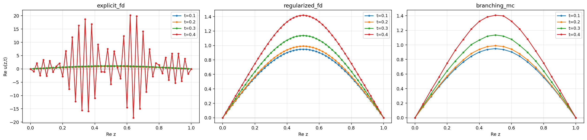

# wavelab 教程 · 5 — 同一个方程，五种解法：完整对比实验

前四章建好了全部理论。本章把五个求解器同时对准主角方程 `SINE_CI_1D`，用真实数字
把整个故事讲完，最后给出"实践中怎么选方法"的决策指南。

## 5.1 实验设置

```python
from wavelab import (library, ExplicitFD, ImplicitFD, LinearlyImplicitFD,
                     RegularizedFD, BranchingMC, compare)

eq = library.SINE_CI_1D          # u_tt + u_xx + u − u³ = 0，sine 初值，c=i
times = [0.1, 0.2, 0.3, 0.4]

fd  = ExplicitFD(N=51, dt=0.002).solve(eq, times)
imp = ImplicitFD(N=101, dt=0.002, theta=0.5).solve(eq, times)
lin = LinearlyImplicitFD(N=101, dt=0.002).solve(eq, times)
reg = RegularizedFD(N=51, dt=0.002, k_max=12).solve(eq, times)
mc  = BranchingMC(lam=0.25, n=40_000, seed=0).solve(eq, times)

print(compare(fd, reg, mc).table(probe_points=[0.1, 0.3, 0.5, 0.7, 0.9]))
```

（一键版本：`examples/illposedness_report.py` 跑完整个六幕剧并出图。）

## 5.2 结果：中心点 $u(0.5, t)$ 全对照

以 MC（$n=4\times10^4$，标准误 ~0.005）为真值基准：

| $t$ | **MC**（真值） | ExplicitFD | ImplicitFD (θ=½) | LinearlyImplicit | RegularizedFD (k≤12) |
|---|---|---|---|---|---|
| 0.1 | 0.948 ± .001 | 0.948 ✓ | 0.948 ✓ | 0.949 ✓ | 0.948 ✓ |
| 0.2 | 0.992 ± .002 | 0.991 ✓ | $O(10)$ ✗ | 死于 t=0.18 | 0.991 ✓ |
| 0.3 | 1.140 ± .003 | 1.137 ✓ | $O(10^3)$ ✗ | — | 1.137 ✓ |
| 0.4 | 1.418 ± .005 | **爆炸**（N=101 时死于 0.232；N=51 苟到 0.44） | $O(10^3)$，符号随机 ✗ | — | 1.418 ✓ |
| 0.7 | 4.559 ± .110 | — | — | — | 4.705（偏 0.15：稳定的代价） |



五个读法：

1. **$t=0.1$ 全员正确**——五个求解器都实现无误。分歧全部来自**方法与问题的
   相性**，不是代码 bug。这就是为什么每个求解器都先在适定问题/闭式解上验证过。
2. **ExplicitFD**：三位数吻合直到死亡，死得诚实（NaN + `blowup_time`）。
3. **ImplicitFD**：最危险的失败模式——全程输出**有限的垃圾**，不看真值根本
   发现不了（第 3 章：$g_+g_-=1$ 的能量守恒诅咒）。这里只写量级不写数值，是因为
   $t\gtrsim0.18$ 以后输出完全由舍入误差的放大决定（$g_*\approx1.51$/步），换一台
   机器、甚至只换一条等价的线性求解路径，数值乃至**正负号**都会变。
4. **RegularizedFD**：小 $t$ 免费精确，$t=0.7$ 起精度付费（偏差 ≈ 30 倍 MC 标准
   误，是结构性偏差不是噪声）。这是 FD 家族唯一能在此问题上"服役"的成员。
5. **MC**：全程无偏 + 自带误差条；$t\gtrsim1.2$ 后死于方差（第 4 章的墙）。

## 5.3 对照组：适定问题上 FD 完全没问题

同样的代码，把方程换成 $c=1$ 的正常波动方程（`f={}`，纯线性，精确解
$u = \sin(\pi x)\cos(\pi t)$）：

```python
import cmath, math
from wavelab import WaveEquation, ExplicitFD

well = WaveEquation(dim=1, c=1, f={}, phi=lambda z: cmath.sin(math.pi*z),
                    psi=lambda z: 0j, domain=((0.0, 1.0),))
sol = ExplicitFD(N=101, dt=0.001).solve(well, times=[0.5])
# max|误差| < 1e-3，且网格加密误差单调下降（tests/test_fd_explicit.py 有此测试）
```

显式 FD 在适定问题上**又快又准且收敛**——本教程不是"FD 不行"的故事，而是
"**方法的适用域由问题的适定性划定**"的故事。

## 5.4 方法选择决策表

| 你的情形 | 用什么 | 理由 |
|---|---|---|
| 适定问题（$c$ 实数），要整个时空场 | `ExplicitFD` | 最快，收敛有保证（CFL 内） |
| 适定 + 刚性/想用大步长 | `ImplicitFD` | 隐式的本职工作是治刚性 |
| **不适定**（$c=i$），短时间，要可信数值 | `BranchingMC` | 唯一无偏；自带 stderr |
| 不适定，要**光滑曲线/整场**且接受偏差 | `RegularizedFD` | 明码标价的稳定（$k_{\max}$） |
| 不适定，要演示"隐式救不了" | `ImplicitFD` / `LinearlyImplicitFD` | 它们就是反例 |
| 复数评估点 $z \in \mathbb{C}$ | `BranchingMC` | 唯一支持 |
| $d = 2, 3$ | `BranchingMC`（+`grad_phi`）；FD 仅 d=2 显式 | 见第 4 章 4.10 |
| 论文规模（$10^6$+ 样本） | `BranchingMC(n=1_000_000)` | 纯 Python，单点约 3 秒 |
| 定位 MC 的时间极限 | `variance_profile` | 相对标准误 >100% 即到墙 |
| 定位 FD 的爆炸规律 | `blowup_scan` + `mode_amplification` | 第 2 章的两件仪器 |

## 5.5 添加你自己的方程（30 秒教程）

```python
import cmath, math
from wavelab import WaveEquation, BranchingMC

my_eq = WaveEquation(
    dim=1, c=1,
    f={2: 1},                              # f(u) = u²
    phi=lambda z: 6 / z**2,                # 必须能吃复数（用 cmath / 多项式）
    psi=lambda z: -12 * math.sqrt(2) / z**3,
    exact=lambda z, t: 6 / (z + math.sqrt(2) * t)**2,   # 有闭式解就填上 → 免费误差表
)
sol = BranchingMC(lam=0.25, n=20_000, seed=1).solve(my_eq, [0.5], points=[3.0])
print(sol.u[0, 0], "±", sol.meta["stderr"][0, 0])
print("exact:", my_eq.exact(3.0, 0.5))
```

要点：`f` 写成 `{幂次: 系数}`；初值必须解析（能在复平面求值）；FD 另需
`domain=`；$d\ge2$ 的 MC 另需 `grad_phi=`。所有校验在构造时立即报错（fail fast），
错误信息会告诉你缺什么。

## 5.6 结语：整个项目的一句话

> **不适定问题上，稳定性无法白嫖。** 差分法必须靠删除信息（正则化）购买稳定，
> 价格是偏差；蒙特卡洛靠"逐点期望、不推进任何状态"绕开了整个问题，价格是方差。
> 理解每种方法**为什么**付出**哪种**代价——这比任何单一方法本身都更重要。

全部数字可复现：`pytest`（102 个测试）锁定了本教程引用的每一个数值；
`examples/illposedness_report.py` 一键重演全部实验；
`docs/tutorial/figures/make_figures.py` 重新生成全部插图。

[← 返回总览](00-overview.md)
